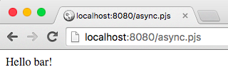
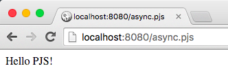

# Asynchronous

PJS templates has a way of handling the asynchronous code. A `done()` method let you control the flow of your async operations.

Let's say that I have an async operation to do before showing my content. If I do this:
```js
<%
var foo = 'bar';
setTimeout(function () {
  foo = 'PJS';
}, 100);
%>
Hello <%= foo %>!
```

Because of the even-loop system, the result will be:



To wait for the `foo` variable to be set, I can add the `done()` method. PJS will understand that it's an async block and will wait until done() is called:
```js
<%
var foo = 'bar';
setTimeout(function () {
  foo = 'PJS';
  done(); // tell PJS it's an async block
}, 100);
%>
Hello <%= foo %>!
```

Now, if you visit http://localhost:8080/async.pjs, you can see:

