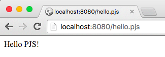

## Hello PJS

Let's look at the examples/hello.pjs file:
```js
<% var foo = 'PJS'; %>
Hello <%= foo %>!
```

You can see the result of this file by going on `http://localhost:8080/hello.pjs`




As you can see, PJS uses the same templating syntax as EJS.

You can omit if you want the `.pjs` in the url (`http://localhost:8080/hello` will have the same result).